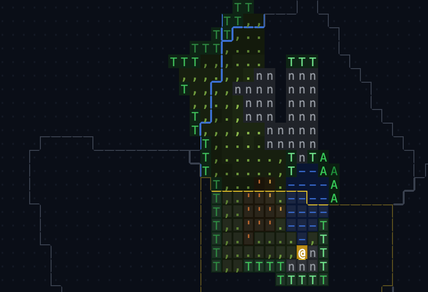
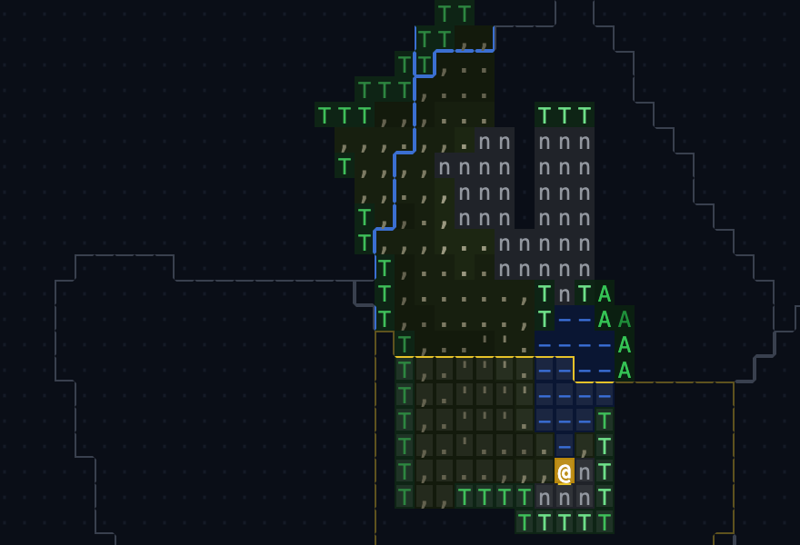
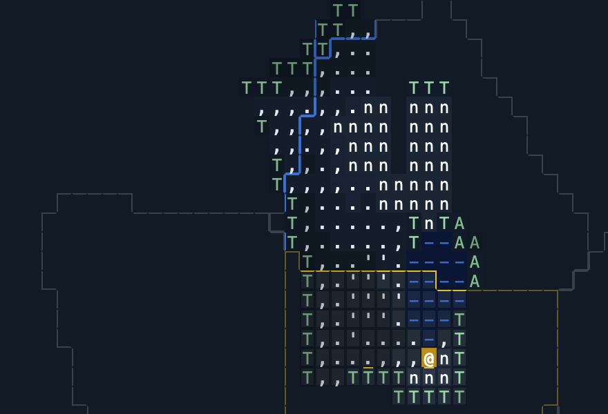
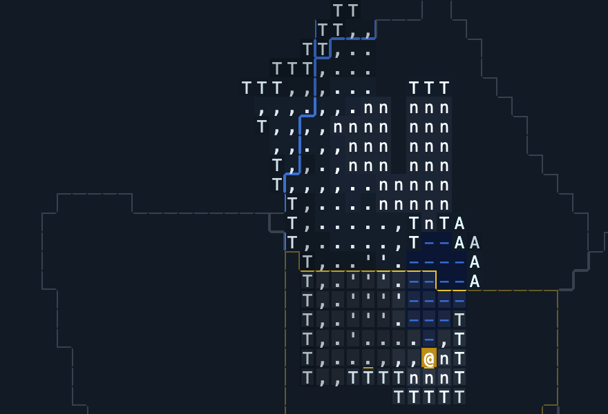
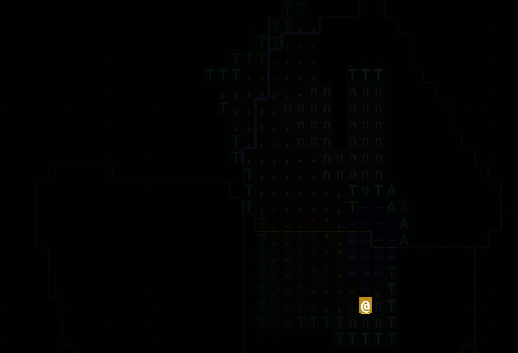
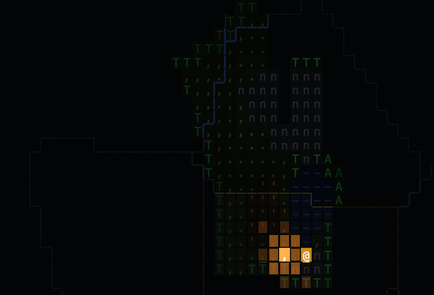
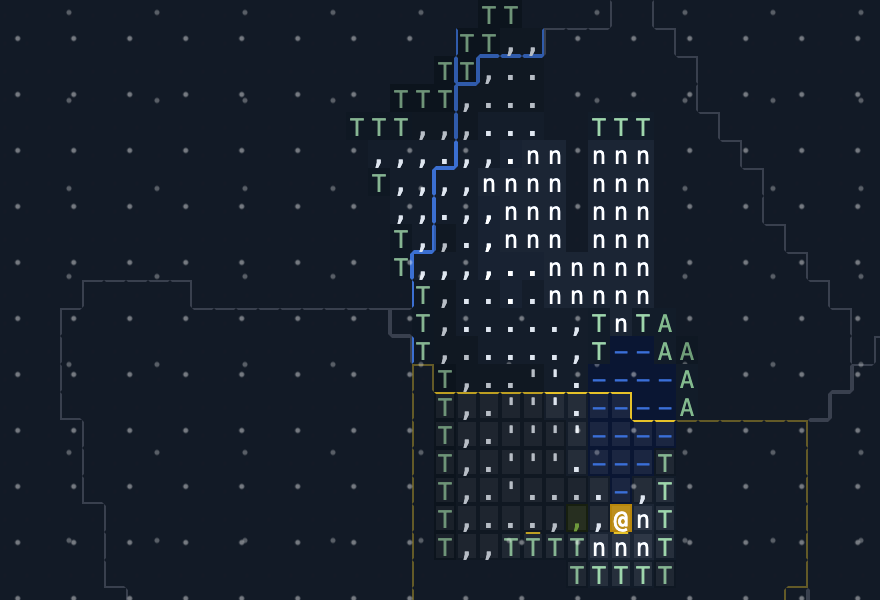

# The map in every condition it draws in

Regenerate with `npm run dev` in one shell and `npm run shots` in another.
These are pictures to look at, not tests: nothing here passes or fails.
The contracts they illustrate are held by `tests/layout.test.ts`.

The conditions are set by writing the grid's classes directly rather than
by playing until the calendar says December, so each image is a true
picture of the stylesheet under that condition and not evidence that the
condition is reached correctly. The firelight rings are placed by hand.

- **spring** (`season-spring`) - the growing season: the ground's own colours

  
- **summer** (`season-summer`) - as spring; nothing in the stylesheet separates them yet

  
- **autumn** (`season-autumn`) - birch gold, the meadow and the bog gone over

  
- **winter-bare** (`season-winter`) - a winter with no snow down: bare birch, dead grass

  
- **winter-snow** (`season-winter snow`) - snow on the ground: evergreens hold their green, the birch does not

  
- **winter-deep** (`season-winter snow snow-deep`) - past DEEP_SNOW_CM: more snow than tree to see

  
- **night** (`season-autumn night`) - the sheet down: you, camp, the fire and the walk line stay up

  
- **night-fire** (`season-autumn night +fire`) - firelight over the ground, rings placed by hand

  
- **rain** (`season-autumn rain`) - falling weather over the ground

  
- **snowing** (`season-winter snow snowing`) - falling weather over the ground

  
