# Simulation-backed local weather references

Regenerate with `npm run dev` in one shell and `npm run shots` in another.
Every image is normal simulation and rendering output selected by the deterministic scenario catalog in `src/sim/weather-scenarios.ts`.
The harness does not assign weather classes, variables, glyphs, or visibility.

- **clear** - 323 cells in the actual current-visibility footprint.

  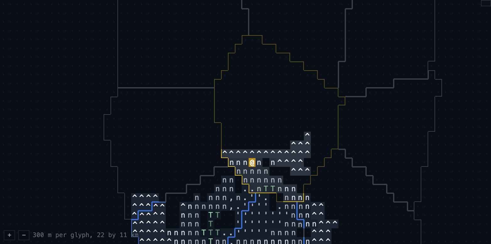
- **sunny-clouds** - 936 cells in the actual current-visibility footprint.

  
- **approaching-rain** - 164 cells in the actual current-visibility footprint.

  
- **local-rain** - 84 cells in the actual current-visibility footprint.

  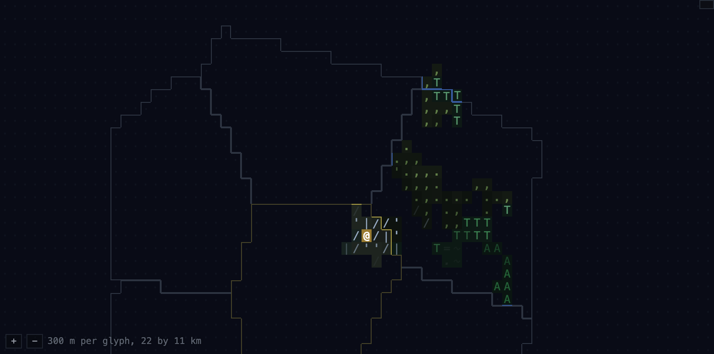
- **persisted-snow** - 1 cells in the actual current-visibility footprint.

  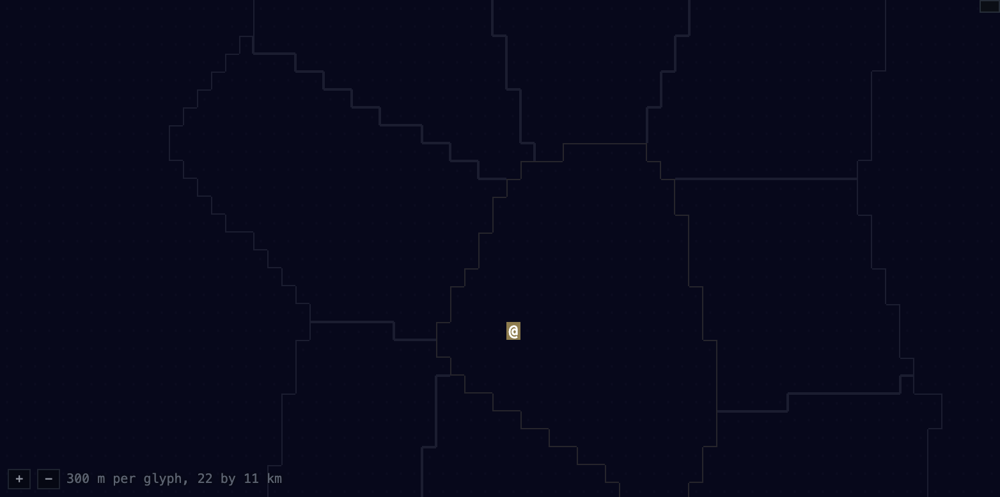
- **frozen-water** - 217 cells in the actual current-visibility footprint.

  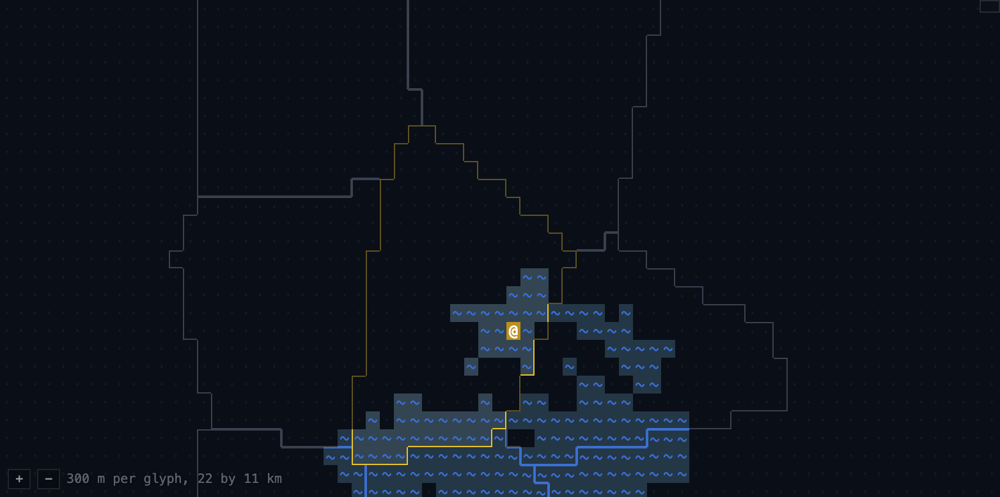
- **valley-fog** - 39 cells in the actual current-visibility footprint.

  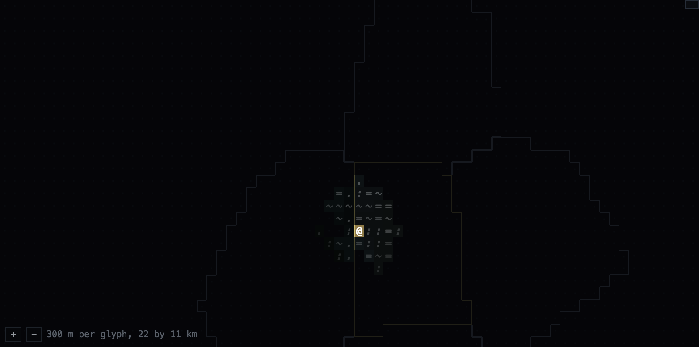
- **windward-lee** - 421 cells in the actual current-visibility footprint.

  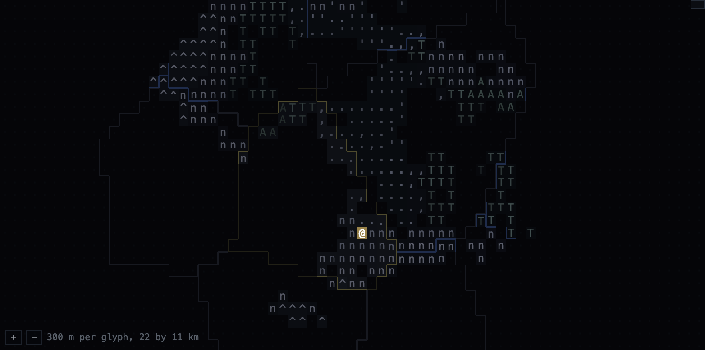
- **obscured** - 1 cells in the actual current-visibility footprint.

  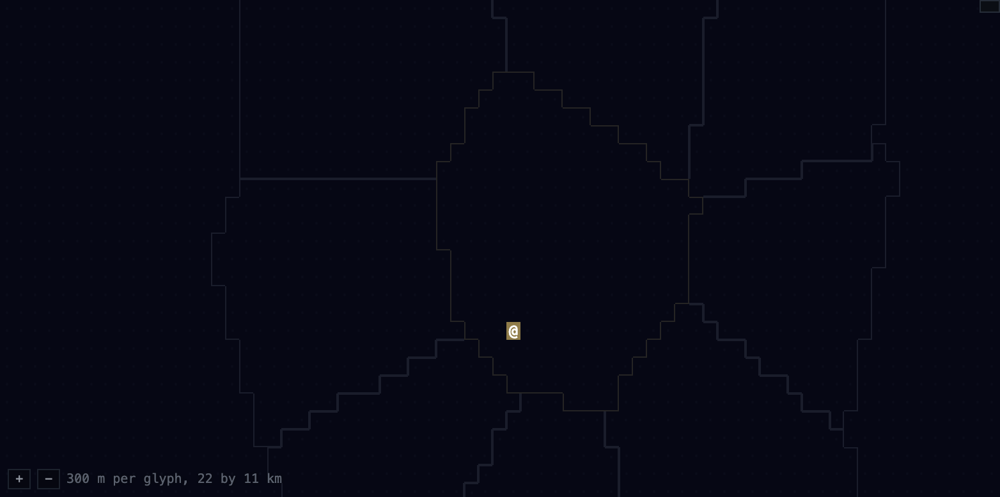

The two fog frames hold the same simulation minute and visibility while one deterministic ASCII state hard-switches to the next.

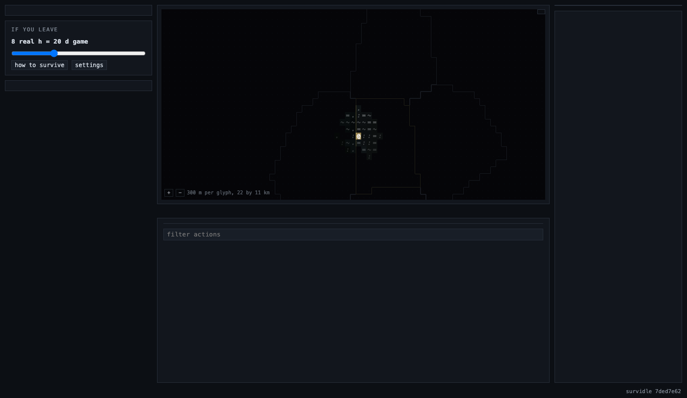

The same approaching-rain simulation is also captured in both persisted display modes. Cloud shadows are the default; ASCII cloud flavor is the optional setting.

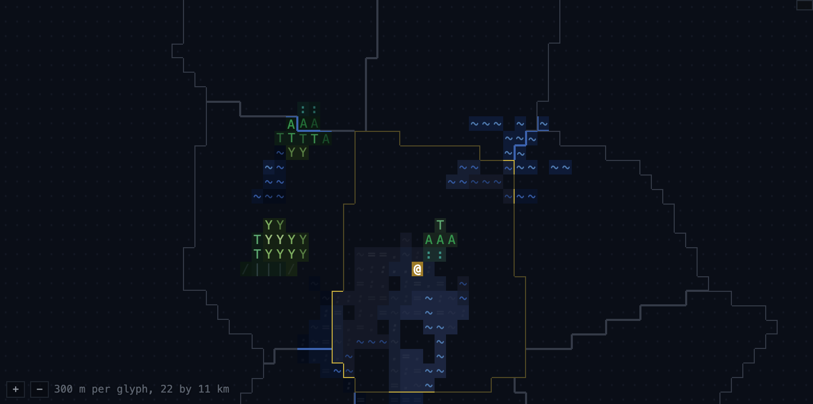

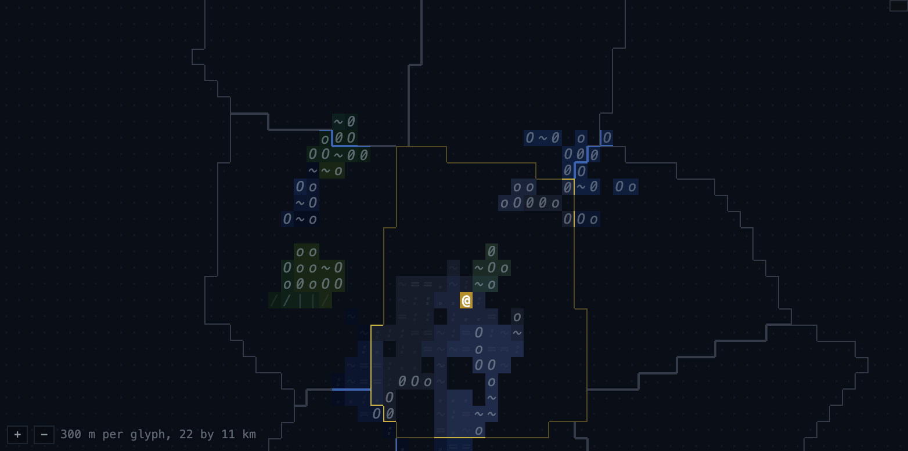

The sunny pair advances the normal simulation by 60 game minutes between frames. The changing cell-owned shadow field comes from the moving simulated cloud field, not screenshot styling.

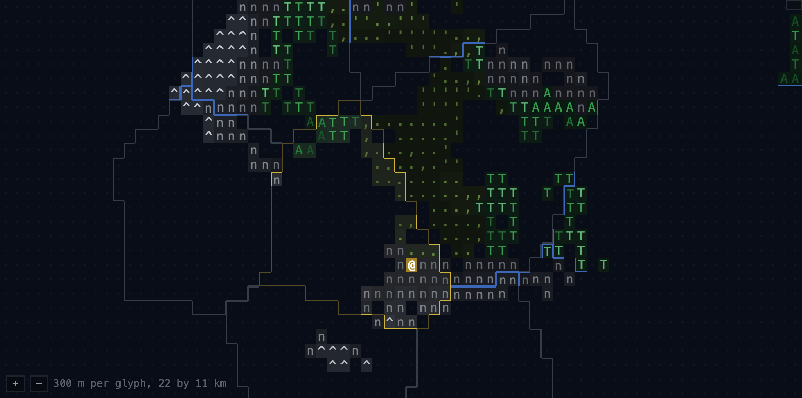

