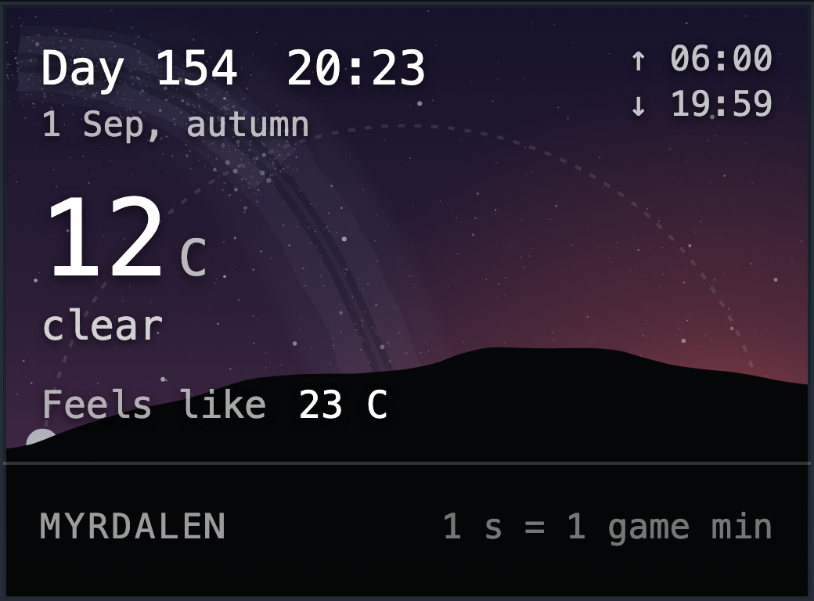
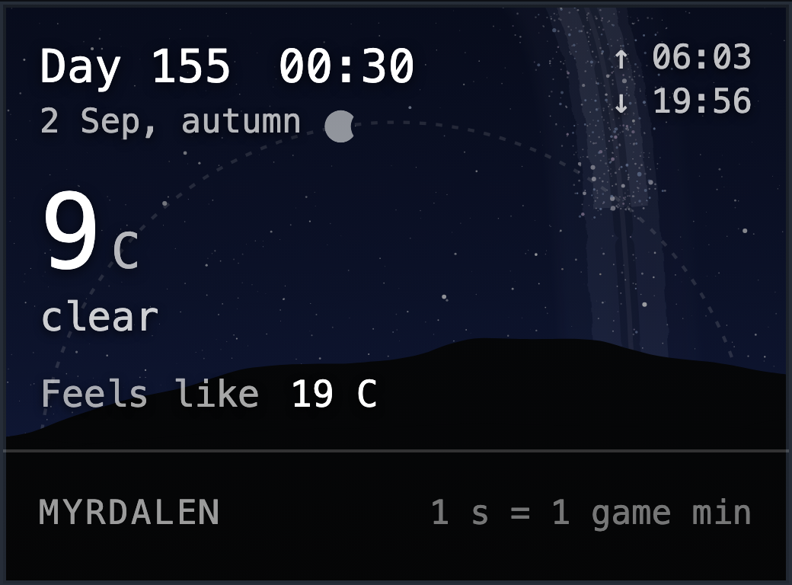
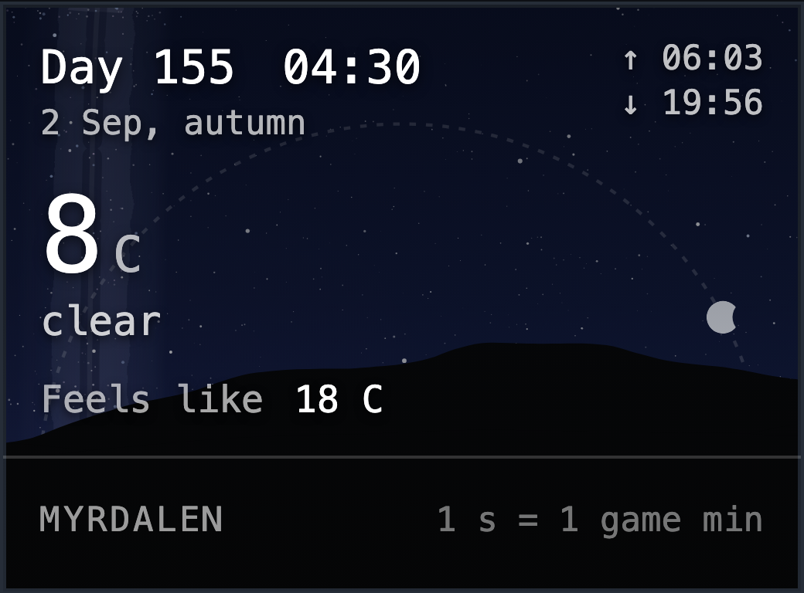
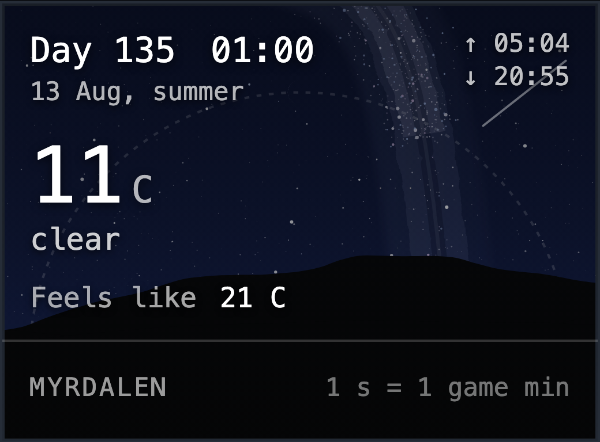

# The skies the weather widget draws

Written by `npm run sky`, from the table in `src/skygallery.ts`. Look at
them; `npm run sky -- --check` says which ones a change has altered.

- **dawn-clear** - the sun on the horizon, coming up

  

- **day-clear** - midsummer noon, nothing in the way

  

- **day-cloudy** - cloud over a bright sky

  

- **dusk** - the sun going down: the pink hour

  

- **golden** - the last light before the sun is gone

  

- **night-clear** - the moon up and the stars out

  

- **galaxy-motion** - real south-facing sky, accelerated through a September night

  

- **galaxy-midnight** - the same astronomical sky four hours later

  

- **galaxy-predawn** - the same astronomical sky near the end of night

  

- **perseids** - a clear night near the Perseid peak

  

- **night-cloudy** - the same night with the stars shut out

  

- **rain-light** - rain, falling straight

  

- **rain-heavy** - heavier rain, thicker cloud

  

- **snow** - snow, wandering down

  

- **storm** - a storm: the fall leans over and hurries

  

- **winter-night** - a long dark, deep snow on the ground

  

- **winter-noon** - what passes for noon in December

  
