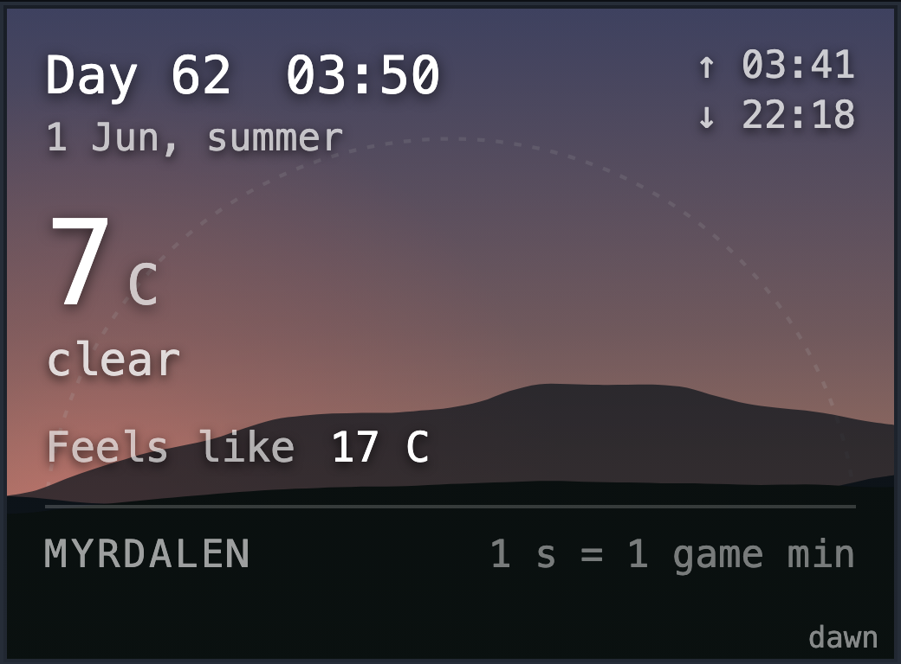
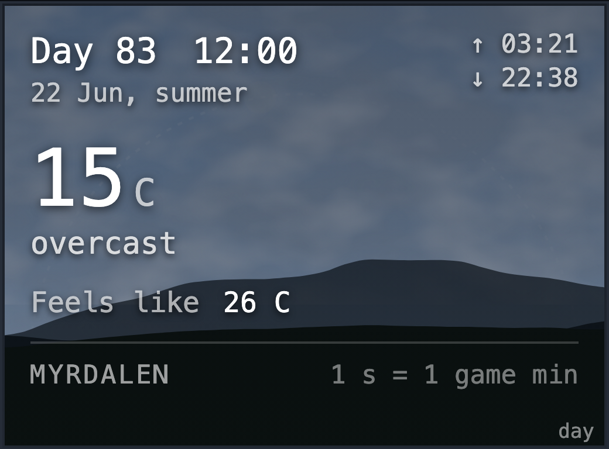
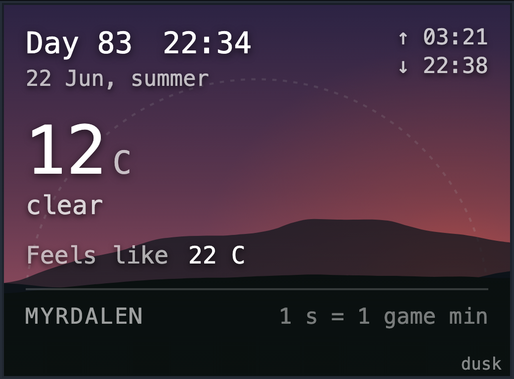
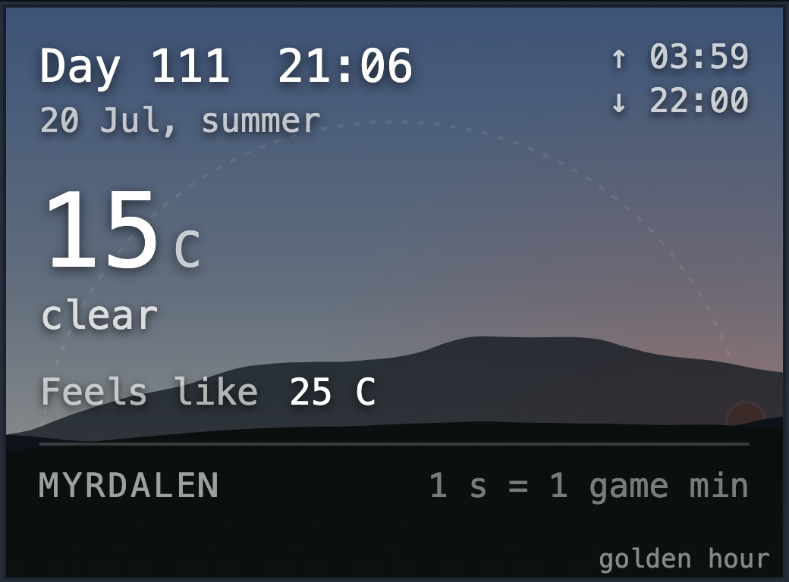
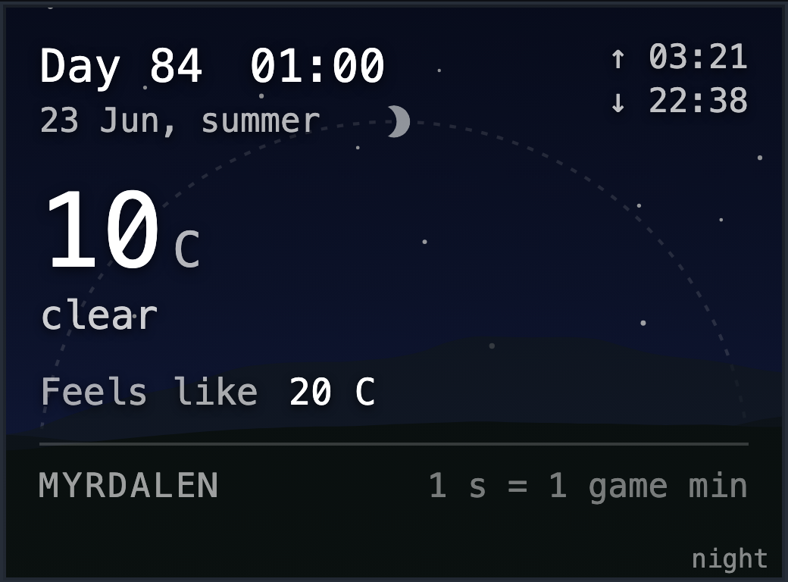
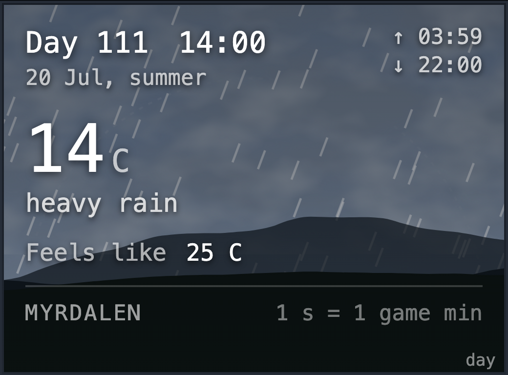
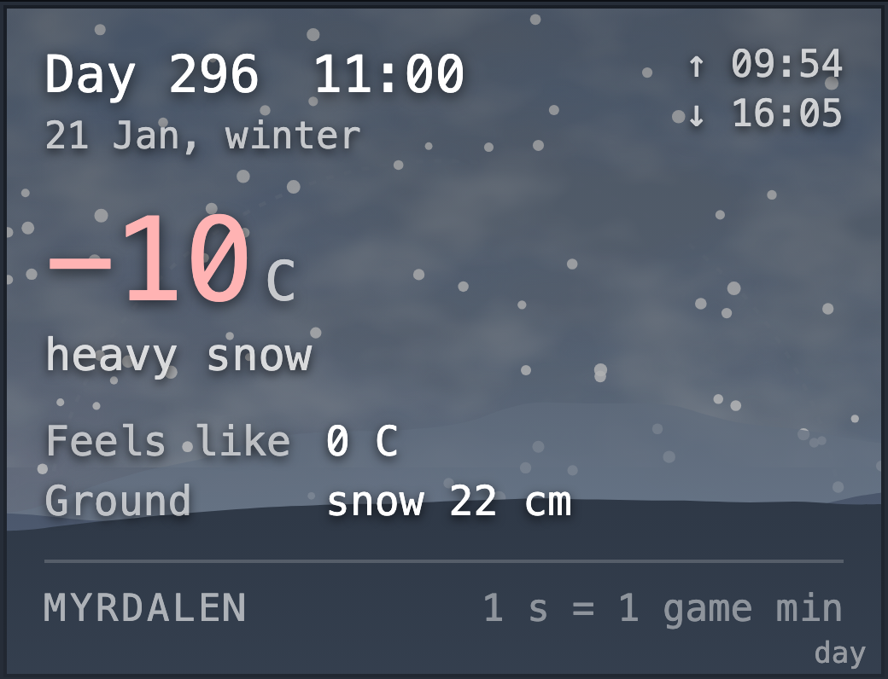
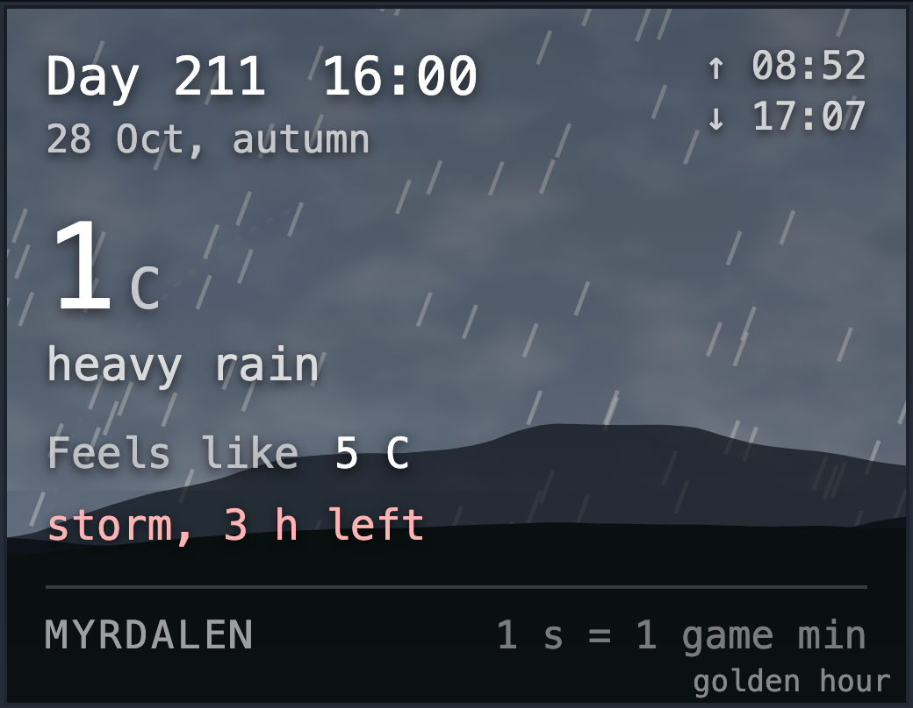
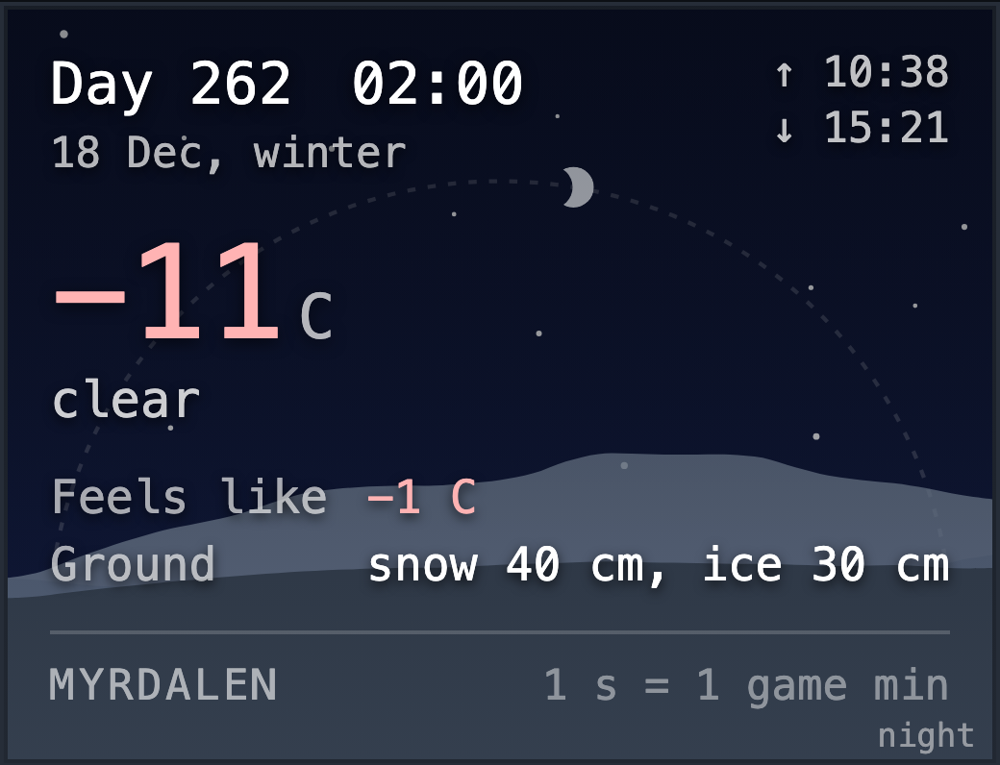
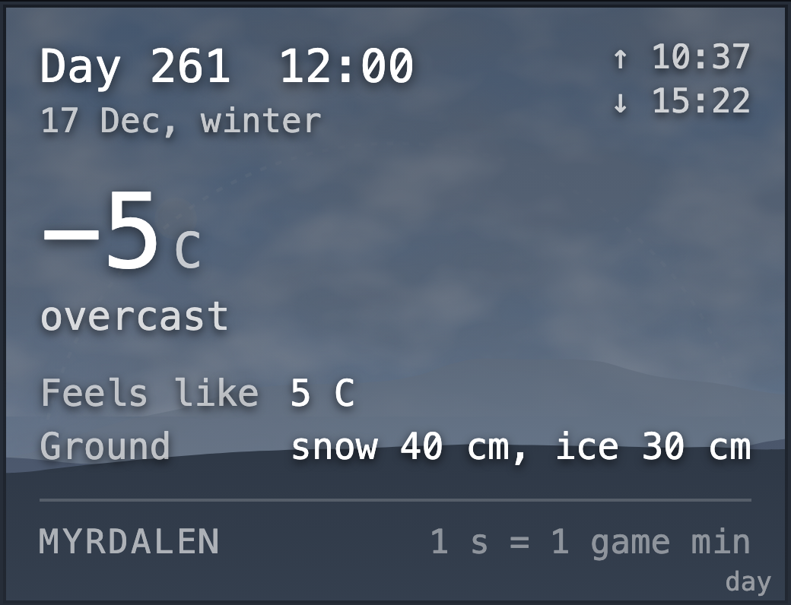

# The skies the weather widget draws

Written by `npm run sky`, from the table in `src/skygallery.ts`. Look at
them; `npm run sky -- --check` says which ones a change has altered.

- **dawn-clear** - dawn-clearthe sun on the horizon, coming up

  

- **day-clear** - day-clearmidsummer noon, nothing in the way

  

- **day-cloudy** - day-cloudycloud over a bright sky

  

- **dusk** - duskthe sun going down: the pink hour

  

- **golden** - goldenthe last light before the sun is gone

  

- **night-clear** - night-clearthe moon up and the stars out

  

- **night-cloudy** - night-cloudythe same night with the stars shut out

  

- **rain-light** - rain-lightrain, falling straight

  

- **rain-heavy** - rain-heavyheavier rain, thicker cloud

  

- **snow** - snowsnow, wandering down

  

- **storm** - storma storm: the fall leans over and hurries

  

- **winter-night** - winter-nighta long dark, deep snow on the ground

  

- **winter-noon** - winter-noonwhat passes for noon in December

  
